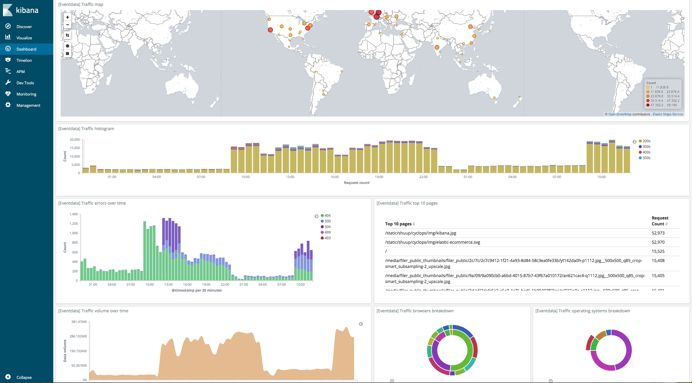
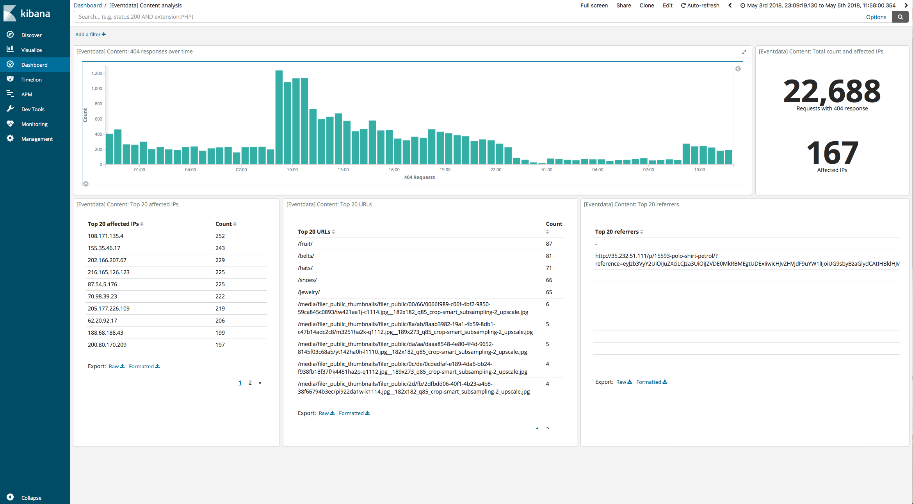

# rally-eventdata-track

Repository containing a Rally track for simulating event-based data use-cases. The track supports bulk indexing of auto-generated events as well as simulated Kibana queries and a range of management operations to make the track self-contained.

This track can be used as-is, extended or adapted to better match your use case or simply be used as a example of how custom parameter sources and runners can be used to create more complex and realistic simulations and benchmarks.

## Installation

Once Rally has been configured, modify the `rally.ini` file to link to the eventdata track repository:

```
[tracks]
default.url = https://github.com/elastic/rally-tracks
eventdata.url = https://github.com/elastic/rally-eventdata-track

```

The track can be run by specifying the following runtime parameters: `--track=eventdata` and `--track-repository=eventdata`

Another option is to download the repository and point to it using the `--track-path` command line parameter.

## Available Challenges

### 1) append-no-conflicts

This is the default challenge, which performs bulk indexing at maximum throughput against a single index for a period of 20 minutes.

### 2) bulk-size-evaluation

This challenge performs bulk-indexing against a single index with varying bulk request sizes, ranging from 125 events/request to 50000 events/request.

### 3) shard-sizing

This challenge indexes 2 million events into an index consisting of a single shard 25 times. After each group of 2 million events has been inserted, 4 different Kibana dashboard configurations are benchmarked against the index. At this time no indexing takes place. There are two different dashboards being simulated, aggregating across 50% and 90% of the data in the shard.

This challenge shows how shard sizing can be performed and how the nature of queries used can impact the results.

### 4) elasticlogs-1bn-load

This challenge indexes 1 billion events into a number of indices of 2 primary shards each, and results in around 200GB of indices being generated on disk. This can vary depending on the environment. It can be used give an idea of how max indexing performance behaves over an extended period of time.

### 5) elasticlogs-querying

This challenge runs mixed Kibana queries against the index created in the **elasticlogs-1bn-load** track. No concurrent indexing is performed.

### 6) combined-indexing-and-querying

This challenge assumes that the *elasticlogs-1bn-load* track has been executed as it simulates querying against these indices. It shows how indexing and querying through simulated Kibana dashboards can be combined to provide a more realistic benchmark.

In this challenge rate-limited indexing at varying levels is combined with a fixed level of querying. If metrics from the run are stored in Elasticsearch, it is possible analyse these in Kibana in order to identify how indexing rate affects query latency and vice versa.

## Custom parameter sources

### elasticlogs\_bulk\_source

This parameter source generated bulk indexing requests filled with auto-generated data. This data is generated based on statistics from a subset of real traffic to the elastic.co website. Data has been anonymised and post-processed and is modelled on the format used by the Filebeat Nginx Module.

The generator allows data to be generated in real-time or against a set date/tine interval. A sample event will contain the following fields:

```
{
	"@timestamp": "2017-06-01T00:01:08.866644Z",
	"offset": 7631775,
	"user_name": "-",
	"source": "/usr/local/var/log/nginx/access.log",
	"fileset": {
		"module": "nginx",
		"name": "access"
	},
	"input": {
		"type": "log"
	},
	"beat": {
		"version": "6.3.0",
		"hostname": "web-EU-1.elastic.co",
		"name": "web-EU-1.elastic.co"
	},
	"prospector": {
		"type": "log"
	},
	"nginx": {
		"access": {
			"user_agent": {
				"major": "44",
				"os": "Mac OS X",
				"os_major": "10",
				"name": "Firefox",
				"os_name": "Mac OS X",
				"device": "Other"
			},
			"remote_ip": "5.134.208.0",
			"remote_ip_list": [
				"5.134.208.0"
			],
			"geoip": {
				"continent_name": "Europe",
				"city_name": "Grupa",
				"country_name": "Poland",
				"country_iso_code": "PL",
				"location": {
					"lat": 53.5076,
					"lon": 18.6358
				}
			},
			"referrer": "https://www.elastic.co/guide/en/marvel/current/getting-started.html",
			"url": "/guide/en/kibana/current/images/autorefresh-pause.png",
			"body_sent": {
				"bytes": 2122
			},
			"method": "GET",
			"response_code": "200",
			"http_version": "1.1"
		}
	}
}
```

### elasticlogs\_kibana\_source

This parameter source supports simulating two different types of dashboards.

**traffic** - This dashboard contains 7 visualisations and presents different types of traffic statistics. In structure it is similar to the `Nginx Overview` dashboard that comes with the Filebeat Nginx Module. It does aggregate across all records in the index and is therefore a quite 'heavy' dashboard.



**content\_issues** - This dashboard contains 5 visualisations and is designed to be used for analysis of records with a 404 response code, e.g. to find links that are no longer leading anywhere. This only aggregates across a small subset of the records in an index and is therefore considerably 'lighter' than the **traffic** dashboard.



**discover** - This simulates querying data through the `Discover` application in Kibana.

## Extending and adapting

This track can be used as it is, but was designed so that it would be easy to extend or modify it. There are two directories named **operations** and **challenges**, containing files with the standard components of this track that can be used as an example. The main **track.json** file will automatically load all files with a *.json* suffix from these directories. This makes it simple to add new operations and challenges without having to update or modify any of the original files.

## Elasticsearch Compatibility

This track requires Elasticsearch 6.x. Earlier versions are not supported.

## Versioning Scheme

From time to time, setting and mapping formats change in Elasticsearch. As we want to be able to support multiple versions of Elasticsearch, we also need to version track specifications. Therefore, this repository contains multiple branches. The following examples should give you an idea how the versioning scheme works:

- master: tracks on this branch are compatible with the latest development version of Elasticsearch
- 6: compatible with all Elasticsearch 6.x releases.
- 2: compatible with all Elasticsearch releases with the major release number 2 (e.g. 2.1, 2.2, 2.2.1)
- 1.7: compatible with all Elasticsearch releases with the major release number 1 and minor release number 7 (e.g. 1.7.0, 1.7.1, 1.7.2)

As you can see, branches can match exact release numbers but Rally is also lenient in case settings mapping formats did not change for a few releases. Rally will try to match in the following order:

1. major.minor.patch-extension_label (e.g. 6.0.0-alpha2)
2. major.minor.patch (e.g. 6.2.3)
3. major.minor (e.g. 6.2)
4. major (e.g. 6)

Apart from that, the master branch is always considered to be compatible with the Elasticsearch master branch.

To specify the version to check against, add `--distribution-version` when running Rally. It it is not specified, Rally assumes that you want to benchmark against the Elasticsearch master version. 

Example: If you want to benchmark Elasticsearch 6.2.4, run the following command:

```
esrally --distribution-version=6.2.4
```

How to Contribute
-----------------

If you want to contribute to this track, please ensure that it works against the master version of Elasticsearch (i.e. submit PRs against the master branch). We can then check whether it's feasible to backport the track to earlier Elasticsearch versions.
 
See all details in the [contributor guidelines](https://github.com/elastic/rally/blob/master/CONTRIBUTING.md).

License
-------
 
This software is licensed under the Apache License, version 2 ("ALv2"), quoted below.

Copyright 2015-2018 Elasticsearch <https://www.elastic.co>

Licensed under the Apache License, Version 2.0 (the "License"); you may not
use this file except in compliance with the License. You may obtain a copy of
the License at

    http://www.apache.org/licenses/LICENSE-2.0

Unless required by applicable law or agreed to in writing, software
distributed under the License is distributed on an "AS IS" BASIS, WITHOUT
WARRANTIES OR CONDITIONS OF ANY KIND, either express or implied. See the
License for the specific language governing permissions and limitations under
the License.
